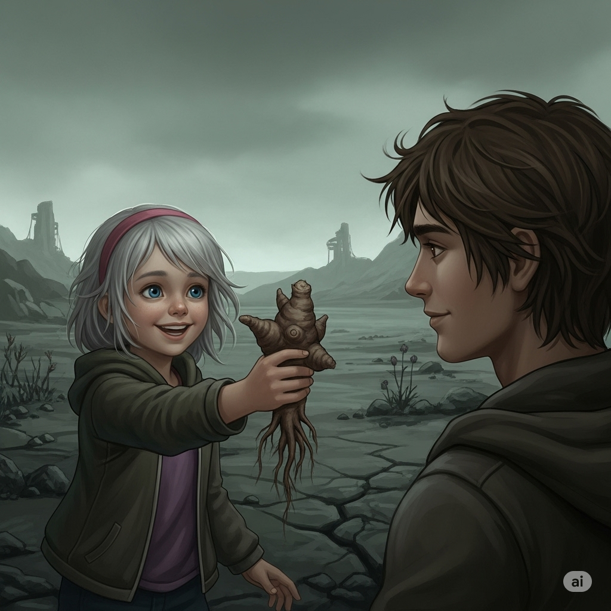
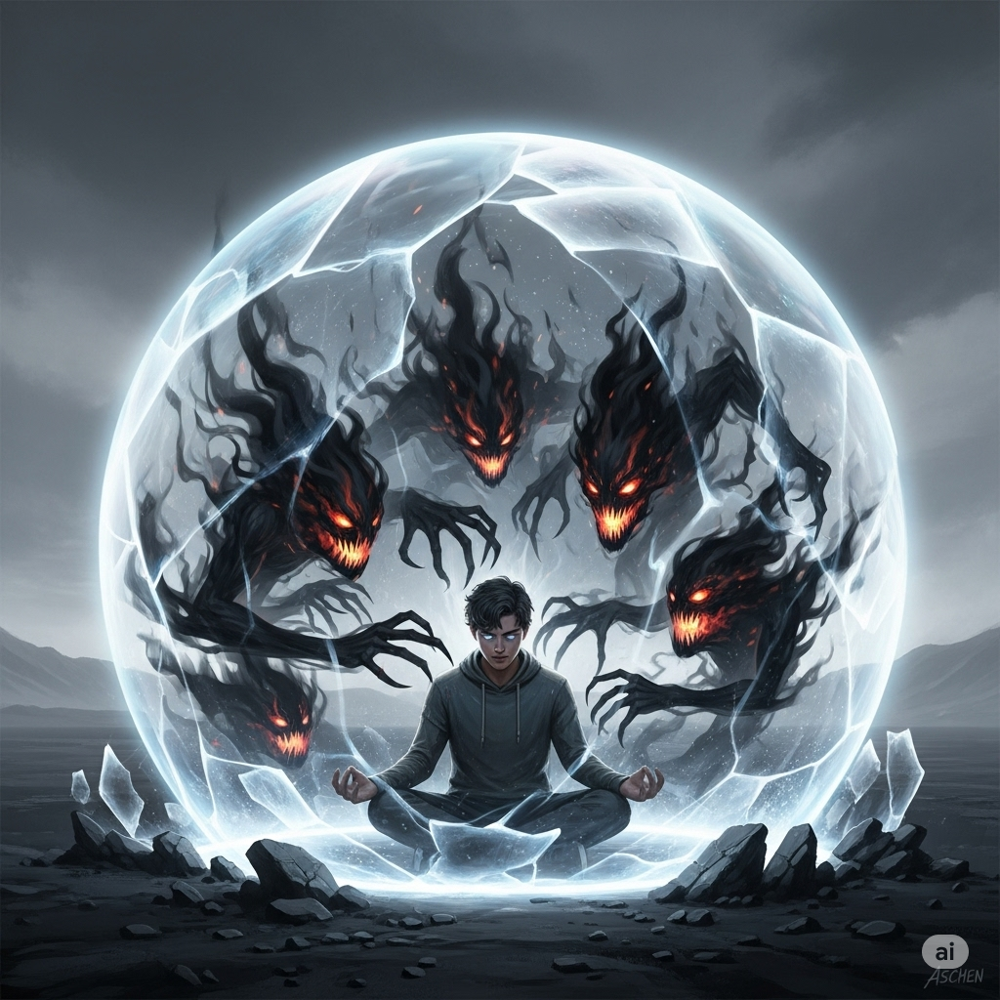
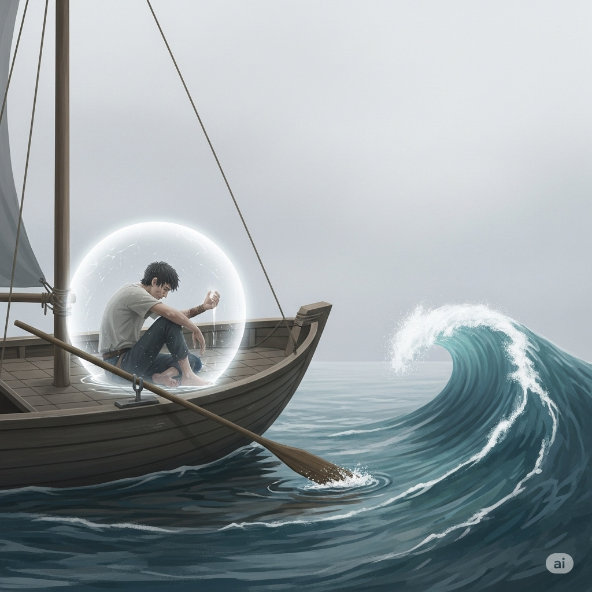
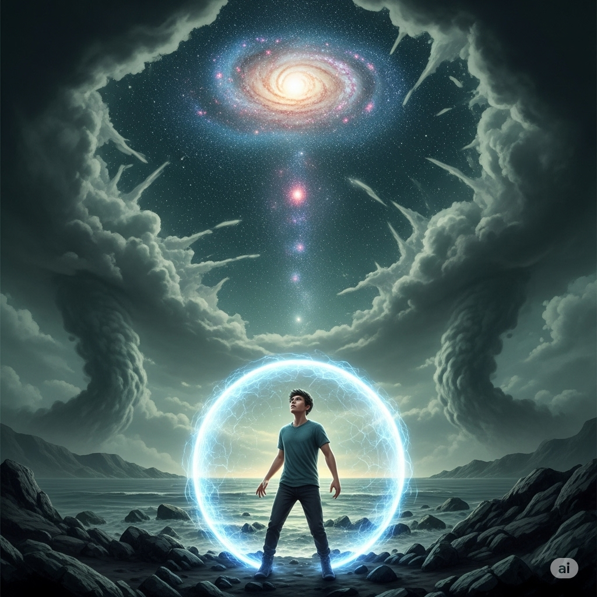

## 📕 ตำนานแห่งแอชเชน

_ลองเอาความเข้าใจของตัวเองมาแต่งเป็นนิยาย sci-fi สั้นๆ ดูครับ_

---

## 💧 บทที่ 1: หยาดโศกา

บนดาวเคราะห์ที่ชื่อ **'แอชเชน'** ไม่เคยมีใครได้เห็นแสงดาว ท้องฟ้าถูกคลุมไว้ด้วยม่านธุลีสีเทาอมเขียวชั่วนิรันดร์ ในอากาศเต็มไปด้วย **หยาดโศกา** ละอองกรดที่มองไม่เห็น มันไม่เพียงกัดกินผิวหนัง แต่ยังซึมลึกลงไปในจิตใจ นำมาซึ่งความสิ้นหวังอันเย็นเยียบที่กัดกร่อนทุกชีวิตจากภายใน

ในที่พักพิงอันอับชื้น **'คาเอล'** เคี้ยวรากไม้แห้งแข็งที่ไร้รสชาติ มันเป็นอาหารเพียงอย่างเดียวที่เขาหาได้ในช่วงเวลานี้ ทุกคำที่กลืนลงไปตอกย้ำถึงความแห้งผากในจิตใจของเขา... โดยเฉพาะเมื่อมันทำให้เขานึกถึงรสหวานเพียงครั้งเดียวที่เคยลิ้มลอง

ภาพของ **เอลารา** ฉายชัดขึ้นในความทรงจำ... เด็กหญิงผมสีซีดที่ยื่นรากไม้รูปร่างประหลาดให้เขา _"พี่ลองชิมสิ มันหวานเหมือนน้ำผึ้งเลย!"_ เธอบอกพร้อมเสียงหัวเราะสดใส _"พี่ต้องสัญญาว่าจะหามาให้อีกนะ"_

คำสัญญานั้นไม่เคยเป็นจริง อ้อมแขนของเขาไม่แข็งแรงพอที่จะกำบังเธอจากหยาดโศกาในวันนั้น และรสหวานเดียวในชีวิตของเขาก็ถูกชะล้างไปพร้อมกับเสียงหัวเราะของเธอ... ที่เงียบหายไปตลอดกาล

ความรู้สึกผิดนั้นเองที่ผลักดันให้เขาค้นหาอะไรบางอย่างทุกซอกทุกมุมของโลกที่ผุพัง จนกระทั่งวันหนึ่ง ในซากยานโบราณลำหนึ่ง เขาได้พบกับบันทึกข้อมูลที่เล่าขานถึงตำนานของ **'ผู้รู้แจ้งองค์แรก'** ผู้ค้นพบเส้นทางและทิ้งบันทึกการเดินทางไว้ เป็นคนแรกที่หลุดพ้นจากชะตากรรมของดาวดวงนี้ได้สำเร็จ บันทึกไม่ได้กล่าวว่าเขาต่อสู้กับพายุ แต่กล่าวว่าเขาได้สร้างสิ่งที่เรียกว่า **'เอกิสแห่งเจตจำนง'** ขึ้นมาคุ้มครองตน

ด้วยแสงริบหรี่แห่งความหวัง... หวังว่าเขาจะเข้าใจถึงคุณค่าการมีอยู่ของตัวเอง คาเอลตัดสินใจที่จะเชื่อในตำนาน เขาเริ่มลงมือทำในสิ่งที่ไม่มีผู้ใดบนดาวทำกัน คือการตั้งมั่นในเจตจำนงของตนเองที่จะไม่เบียดเบียนสรรพสิ่ง

ในตอนแรก มันแทบไม่เกิดอะไรขึ้น แต่เมื่อเขาตั้งมั่นต่อไปเรื่อยๆ เขาก็รู้สึกได้ถึงพลังงานอุ่นๆ ที่ก่อตัวขึ้นรอบกาย... **'เอกิส'** ได้เริ่มก่อกำเนิดขึ้นแล้ว มันเป็นเพียงม่านพลังงานบางเบาที่สั่นไหว แต่ก็พอจะทำให้หยาดโศกาที่รุนแรงที่สุดเบาบางลงได้

---

## ☁️ บทที่ 2: เหล่าแฟนธอม

ทว่า... ในขณะที่เอกิสเกราะแห่งเจตจำนงเริ่มแข็งแกร่งขึ้น ศัตรูใหม่ก็ได้ปรากฏกาย จากความมืดรอบตัว สิ่งมีชีวิตที่ทำจากเงาและความว่างเปล่า ในบันทึกเรียกว่า **'แฟนธอม'** เริ่มพุ่งเข้าโจมตีเอกิสของเขา

พวกมันรวดเร็วและเกิดขึ้นอย่างต่อเนื่อง ทำให้เอกิสที่เพิ่งตั้งไข่สั่นคลอนและจวนเจียนจะสลายไปนับครั้งไม่ถ้วน

คาเอลทำได้เพียงประคองเอกิสสู้กับมัน จนกระทั่งเขาได้สังเกตเห็นความจริงอันน่าประหลาดใจ... **แฟนธอมไม่ได้มาจากความมืดภายนอก พวกมันก่อตัวขึ้นจาก "ความว่างเปล่า" ที่อยู่ภายในเอกิสของเขาเอง!**

แรกเริ่ม เขายังคงพลาดพลั้ง เขาจะรู้ตัวก็ต่อเมื่อ **"เงาเดือดดาล"** ได้ลุกโชนเป็นเปลวไฟสีดำที่ทรงพลังเสียแล้ว การจะสยบมันต้องใช้พลังใจมหาศาล เขาจะเห็น **"เงากระหาย"** ก็ต่อเมื่อมันกลายเป็นสนามแม่เหล็กอันบิดเบี้ยวที่เกือบจะฉีกกระชากเอกิสของเขาเป็นชิ้นๆ

เขาตระหนักว่ายิ่งปล่อยให้แฟนธอมก่อตัวนานเท่าไหร่ มันก็ยิ่งแข็งแกร่งและรับมือได้ยากขึ้นเท่านั้น

จนกระทั่งในชั่วขณะแห่งความสงบหนึ่ง เขาสังเกตเห็นบางสิ่งที่ต่างออกไป... เป็นเพียงไอลางๆ ของหมอกควันขุ่นมัวที่เพิ่งเริ่มก่อตัวขึ้นที่มุมหนึ่งของม่านพลังงาน มันยังอ่อนแอและแทบไม่มีตัวตน

คาเอลลองเพ่งสมาธิไปที่มัน และในฉับพลันนั้นเอง ไอหมอกที่กำลังจะกลายเป็น **"เงาวังวน"** ตัวการที่สามารถสร้างความสับสนและหลงลืม ก็สลายไปอย่างง่ายดาย... **ง่ายจนน่าตกใจ**

นี่คือการค้นพบที่เปลี่ยนทุกสิ่ง เขาเลิกที่จะต่อสู้กับแฟนธอมที่เติบโตเต็มที่ แต่เปลี่ยนมาเป็นการฝึกฝนความไวในการรับรู้ เขากลายเป็น **ผู้เฝ้าระวังแห่งจิตใจตนเอง** เรียนรู้ที่จะสังเกตสัญญาณแรกเริ่มของการก่อตัว

ทุกครั้งที่ **"เงากระหาย"**, **"เงาเดือดดาล"**, หรือ **"เงาวังวน"** เริ่มปรากฏเป็นเพียงระลอกคลื่นจางๆ เขาจะรับรู้ได้ทันท่วงทีและสลายมันไปในพริบตา ก่อนที่มันจะมีพิษสงใดๆ

นานวันเข้า การเฝ้าระวังนี้ก็กลายเป็นเรื่องง่ายดาย เอกิสแห่งเจตจำนงของเขาก็หนาแน่นและส่องสว่างขึ้นเรื่อยๆ จนแข็งแกร่งดุจผลึกใส หยาดโศกาไม่สามารถทำอะไรเขาได้อีกต่อไป แฟนธอมก็กลายเป็นเพียงระลอกคลื่นเล็กๆ ที่มาแล้วก็หายไป... ไร้ซึ่งพลังอำนาจโดยสิ้นเชิง

เขายืนอยู่ท่ามกลางความสงบอย่างที่ไม่เคยสัมผัสมาก่อน

---

## 🌊 บทที่ 3: มหาสมุทรที่ไร้จุดหมาย

ความสงบนี้ไม่ใช่คำตอบ แม้กายจะปลอดภัยจากหยาดโศกา แต่ความว่างเปล่าที่เกิดจากการสูญเสียเอลารายังคงกัดกินใจ _สิ่งนี้ไม่ใช่คำตอบที่ข้าค้นหา…_

ด้วยคำถามนั้นนำทาง เขาหวนนึกถึงส่วนที่ลึกลับที่สุดในตำนานของผู้รู้แจ้งองค์แรก ที่ไม่ได้กล่าวถึงแค่การป้องกัน แต่กล่าวถึงต้นตอที่แท้จริงของหยาดโศกาและเหล่าแฟนธอม... **"จักรกลแห่งอาดูร"**

บันทึกยังเล่าถึงการเดินทางที่ยิ่งใหญ่เพื่อค้นหา **"วิหารที่จมดิ่ง"** ซึ่งเป็นที่เก็บซ่อนอาวุธเพียงหนึ่งเดียวที่จะหยุดยั้งจักรกลนั้นได้ แต่บันทึกไม่ได้ให้พิกัดใดๆ ไว้เลย

ด้วยศรัทธานั้นเอง คาเอลได้พบเรือใบเก่าแก่แต่แข็งแรงลำหนึ่ง เขาซ่อมแซมมันและออกเดินทางสู่มหาสมุทรอันเวิ้งว้างภายใต้ท้องฟ้าสีเทา... **โดยไร้ซึ่งแผนที่**

การเดินทางครั้งนี้ทดสอบเขาในทุกมิติ

คืนหนึ่ง สัตว์ทะเลยักษ์โผล่ขึ้นจากความมืด มันโจมตีเรืออย่างบ้าคลั่ง ความกลัวเข้าถาโถมเขาอย่างท่วมท้น คาเอลไม่ได้ต่อสู้เพื่อเอาชนะ แต่เพื่อปกป้องเรือลำนี้... ปกป้องร่างกายหนึ่งเดียวของเขา

เขาขับไล่มันไปได้ แต่เรือก็เสียหายหนัก เขาใช้เวลาหลายวันซ่อมแซมมันพลางมองดูรอยแผลบนแขนและรอยแตกบนตัวเรือ เขาตระหนักว่าทั้งสองสิ่งนี้ไม่ต่างกันเลย... **เปลี่ยนแปลงอยู่ตลอดเวลา ต้องผุพังและถูกซ่อมแซม วนเวียนอยู่เช่นนี้เอง**

เมื่อลมสงบนิ่ง เขาต้องเผชิญกับความเงียบที่น่ากลัวกว่าพายุ มันทำให้ภาพอดีตปรากฏขึ้นข้างหน้าเขาราวกับมีชีวิต ภาพของเอลารา... เธอกำลังยื่นรากไม้รสหวานให้เขาอีกครั้ง _"พี่สัญญานะ..."_ เสียงของเธอดังก้องใส

ทันใดนั้น ภาพก็เปลี่ยนเป็นวันที่ท้องฟ้ามืดมน ร่างของเธอกำลังเลือนหายไปในม่านของหยาดโศกา หัวใจของเขาบีบรัดอย่างรุนแรง ความเจ็บปวดทะลักขึ้นมาจุกที่ลำคอ

นี่คือสิ่งที่เกิดขึ้นเสมอ แต่ครั้งนี้... เขาไม่ได้กระโจนเข้าไปในภาพนั้น เขาเพียงยึดหางเสือไว้มั่น คงความเป็นกัปตันของเรือลำนี้... และเป็นเพียงผู้ชมของละครฉากเก่า

เขาเฝ้ามองภาพเด็กชายที่สิ้นหวังร่ำไห้ราวกับเป็นคนอื่น... จนกระทั่งภาพทั้งหมดค่อยๆ โปร่งแสงและจางหายไปกับเกลียวคลื่น

บททดสอบที่หนักหน่วงที่สุดคือเสียงกระซิบที่โจมตีจากภายในโดยตรง

_"เจ้าคือผู้ถูกเลือก คาเอล... มีเพียงเจ้าเท่านั้นที่จะทำได้"_ เสียงหนึ่งดังขึ้นอย่างทรงอำนาจ เขากำหางเสือแน่น รู้สึกถึงความทะนงตนที่พองฟูขึ้นในอก หัวใจของเขาเต้นแรงด้วยความฮึกเหิม แต่ความรู้สึกนั้นกลับทำให้เรือโคลงเคลงอย่างน่ากลัว ราวกับจะตอบสนองต่อความหยิ่งผยองของเขา

_"ผู้ถูกเลือกงั้นรึ?"_ อีกเสียงหนึ่งหัวเราะเยาะอย่างเย็นเยียบ _"เจ้าปกป้องน้องสาวคนเดียวยังไม่ได้เลย! มือของเจ้าในวันนั้นมันไร้ค่าแค่ไหน จำไม่ได้แล้วหรือ? หันเรือกลับไปซะเถอะ ก่อนจะไปตายอย่างน่าสมเพชกว่าเดิม!"_

_"ข้าไม่ใช่คนขลาด!"_ เขาตะโกนสวนกลับไปในความว่างเปล่า แต่เสียงของเขาถูกกลืนหายไปในความเงียบ และเสียงกระซิบนั้นกลับดังขึ้นกว่าเดิม มันแทงทะลุใจกลางความรู้สึกผิดของเขา

แล้วเสียงสุดท้ายก็ดังขึ้น... นุ่มนวลและเย้ายวนที่สุด... _"เหนื่อยแล้วใช่ไหม คาเอล? เจ้าได้พบความสงบแล้วในเอกิสของเจ้า จะดิ้นรนไปอีกทำไม? ทิ้งหางเสือนั่นเสียสิ... ปล่อยเรือให้ลอยไป... แล้วพักผ่อนเสียเถิด..."_

เสียงนี้เกือบทำให้เขายอมแพ้ เรี่ยวแรงทั้งหมดหายไปดื้อๆ เขาทรุดตัวลงข้างหางเสือ หายใจหอบถี่ ปล่อยให้เสียงในหัวโจมตีเขาอย่างอิสระ

และในความพ่ายแพ้นั้นเอง... เขาก็หยุด เขานั่งนิ่งๆ และทำเพียงแค่ **"ฟัง"**... เขาไม่โต้เถียง ไม่ต่อต้าน ไม่ตัดสิน

เขาเฝ้ามอง **"เสียงทะเยอทะยาน"** เกิดขึ้น... ทำให้หัวใจพองโต... แล้วก็จางหายไป เขาเฝ้ามอง **"เสียงกล่าวโทษ"** กรีดแทงเข้ามา... ทำให้เจ็บปวด... แล้วก็ค่อยๆ คลายลง เขาเฝ้ามอง **"เสียงเย้ายวน"** กล่อมเขา... ทำให้รู้สึกอ่อนล้า... แล้วก็เงียบไปเอง...

เมื่อไม่มีผู้ใดยึดถือหรือต่อสู้ด้วย พายุแห่งความคิดก็สลายไปในความเงียบอันสมบูรณ์ของมหาสมุทร...

หลังจากผ่านบททดสอบมากมายจนดูเหมือนไม่มีที่สิ้นสุด...

เรือของเขาผุพัง ร่างกายของเขาอ่อนล้า เสบียงหมดสิ้น เขาทรุดตัวลง ในความเงียบงัน สายตาของเขาจับจ้องไปยังมือที่เหี่ยวย่นของตน ที่ครั้งหนึ่งเคยแข็งแรงและมีกำลัง แต่ตอนนี้กลับอ่อนล้าและโรยรา

เขาเหลือบมองไม้พายที่ผุกร่อนในมือ... ที่เขาเคยยึดมันไว้แน่นราวกับเป็นส่วนหนึ่งของชีวิต ถัดออกไปคือเกลียวคลื่นที่ก่อตัวขึ้นอย่างสง่างามเพียงชั่วครู่... แล้วก็แตกสลายหายไปกับผืนน้ำอันไร้ที่สิ้นสุด

**มือที่พยายามจะกอบกุม... ไม้พายที่พยายามจะยึดไว้... คลื่นที่เกิดขึ้นแล้วดับไป...**

สายตาของเขาจับจ้องไปยังมือที่กำไม้พายจนเกร็ง... เกร็ง... แบบเดียวกับที่เขาเคยกำหมัดเพื่อประคองเอกิสสู้กับแฟนธอม... เกร็ง... แบบเดียวกับที่เขาเคยคว้าแขนของเอลาราไว้ในวันนั้น... **การดิ้นรนทั้งหมดของเขาคือการกำแน่นเช่นนี้เอง**

แล้วเขาก็มองเลยไปยังเกลียวคลื่นที่ก่อตัวขึ้นอย่างสง่างาม... มันทะยานขึ้นสู่จุดสูงสุด... แล้วก็แตกสลายคืนสู่ผืนน้ำอันไร้ที่สิ้นสุด... มันไม่ได้พยายาม **"ยึด"** ตัวเองไว้เลย มันไม่ได้ **"เกร็ง"** เพื่อคงอยู่... มันเพียงก่อตัวขึ้น ตั้งอยู่ แล้วก็ดับไป... ตามธรรมชาติของมัน

**มือที่กำแน่น... กับคลื่นที่ปล่อยวาง...**

ในวินาทีที่ภาพทั้งสองซ้อนทับกันอย่างสมบูรณ์... กล้ามเนื้อทุกมัดในแขนที่เคยเกร็งแน่นราวกับจะบดไม้พายให้แหลกคามือ... พลันคลายออกอย่างช้าๆ ไม้พายหลุดจากมือที่อ่อนแรงกระทบกับพื้นเรือเสียงดังปึง! ลมหายใจที่เคยติดขัดอยู่ใต้ลิ้นปี่ถูกปล่อยออกมาเป็นเฮือกยาว... เป็นครั้งแรกในรอบหลายปี... **ไม่ใช่การยอมแพ้ แต่คือการยอมรับ**

ในจังหวะเดียวกันนั่นเอง เสียงหัวเราะแหบแห้งหลุดออกมาจากริมฝีปากที่แตกระแหง ไม่ใช่เสียงหัวเราะแห่งชัยชนะ แต่เป็นเสียงหัวเราะแห่งการปลดปล่อยอันเหนื่อยอ่อน... **เมื่อนักสู้ได้ตระหนักว่าสงครามที่เขาต่อสู้มาทั้งชีวิต มีเพียงเขาคนเดียวในสนามรบนั้น**

ไม่มีวิหาร ไม่มีอาวุธในตำนาน... การเดินทางทั้งหมดนี้คือคำอุปมา เพื่อพาตัวเองมาสู่ความ **"เห็นจริง"** ข้อนี้เพียงข้อเดียว

---

## ⚙️ บทที่ 4: จักรกลแห่งอาดูร

ด้วยดวงตาคู่ใหม่ คาเอลมองไปยังโลกของเขาอีกครั้ง เขาคาดว่าจะได้เห็น **"จักรกลแห่งอาดูร"** ที่น่าสะพรึงกลัวตามที่ตำนานกล่าวไว้... แต่เบื้องหน้าของเขามีเพียงม่านธุลีสีเทาอันคุ้นเคย และความเย็นเยียบที่ยังคงลอยอวลอยู่เช่นเดิม

ความสงสัยวูบขึ้นมาในใจ... _หรือการเดินทางทั้งหมดนี้จะสูญเปล่า?_

ในวินาทีแห่งความสงสัยนั่นเอง การสั่นสะเทือนอันคุ้นเคย... อะไรบางอย่างที่ทำงานอยู่เบื้องหลังการรับรู้ทั้งหมด อะไรที่เขาเคยคิดว่าเป็นเสียงของจักรวาล... แต่บัดนี้เขารู้แล้วว่ามันดังมาจากที่ที่ใกล้กว่านั้น...

ทันทีที่เขารู้ทันที่มาของเสียงนั้น โลกเบื้องหน้าก็เริ่มเปลี่ยนไป ม่านเมฆสีเทาที่เคยทึบตันเริ่มสูญเสียความหนักแน่นของมัน กลายเป็นเพียงภาพฉายที่โปร่งแสงและสั่นไหว ความเย็นเยียบของหยาดโศกาที่กัดกินผิว... ก็ค่อยๆ จางลง กลายเป็นเพียงความทรงจำของความรู้สึก...

เขาไม่ได้ต่อสู้กับมัน เขาไม่ได้ทำลายมัน... เขาเพียงแค่ **'รู้ทัน'** กลไกการทำงานของมัน การปรุงแต่งที่ฉายภาพแห่งความทุกข์ทับลงบนความจริงอันว่างเปล่า

และเมื่อปราศจากเชื้อเพลิงแห่งความไม่รู้... **"จักรกล"** ก็ค่อยๆ หยุดทำงาน...

ภาพฉายท้องฟ้าสีเทาอันยาวนานก็ดับวูบลง... เสียงหวีดหวิวของหยาดโศกาที่เคยกรีดร้องในโสตประสาทพลันเงียบสนิท ความเย็นเยียบที่กัดกินผิวได้จางหายไป... เมื่อเขารับรู้ทุกสิ่งด้วยความเข้าใจอันสงบและเป็นกลาง

และเบื้องหลังภาพลวงตานั้น คือสิ่งที่เคยอยู่ตรงนั้นมาตลอดแต่เขาไม่เคยเห็น...

**ท้องฟ้าที่แท้จริง... ที่เต็มไปด้วยดวงดาวพร่างพราวระยิบระยับนับล้านดวง**

คาเอลไม่ได้หนีออกจากแอชเชน... แต่เขาได้ **"ตื่นขึ้น"** จากความฝันอันยาวนานที่ชื่อแอชเชน ดวงดาวที่เขาเห็น คือความจริงที่ถูกซ่อนอยู่มาตลอดการเดินทาง... และมันเป็นเช่นนั้นเอง

---

_หมายเหตุ: นิยายเรื่องนี้เป็นผลงานสร้างสรรค์ที่แต่งขึ้นเพื่อสะท้อนมุมมองเกี่ยวกับการพัฒนาจิตวิญญาณและการค้นพบตนเอง_
